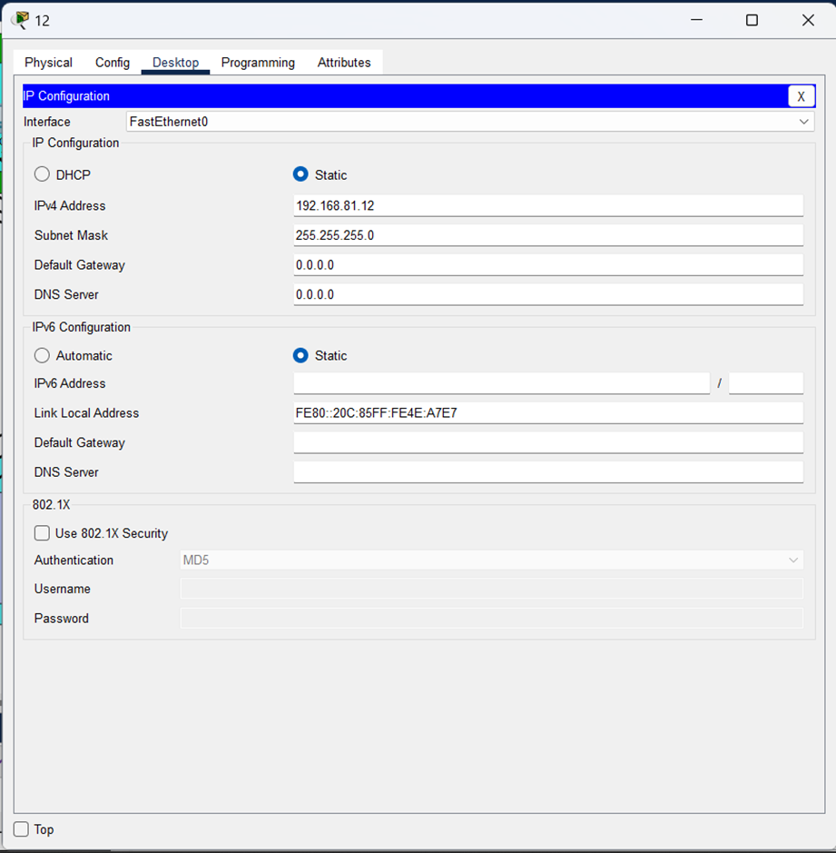
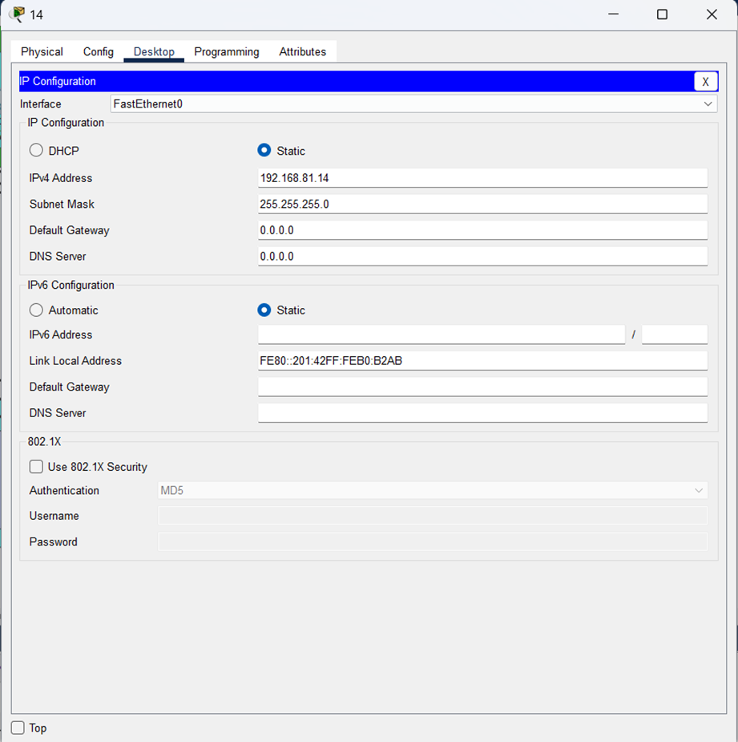
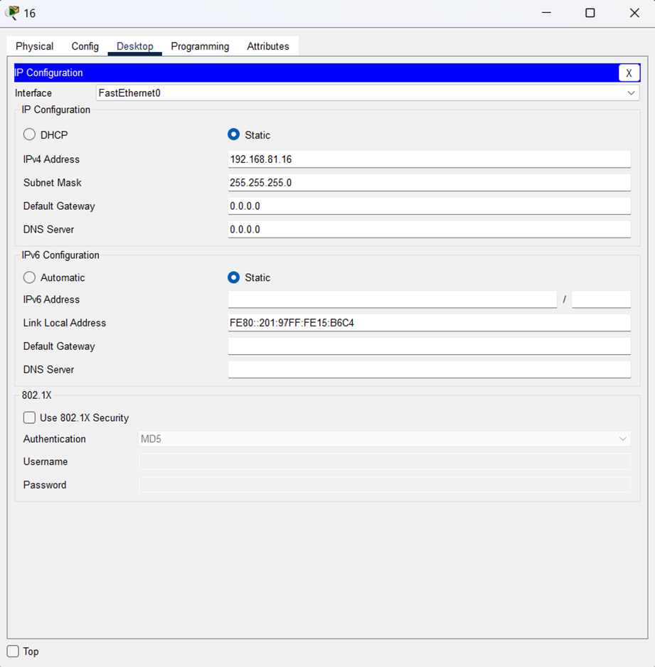
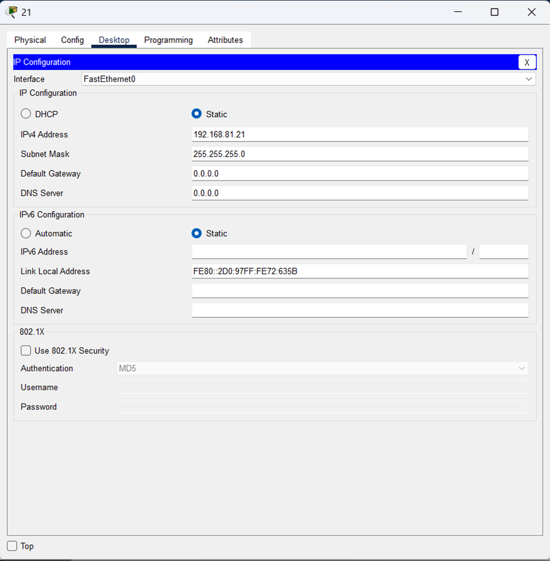
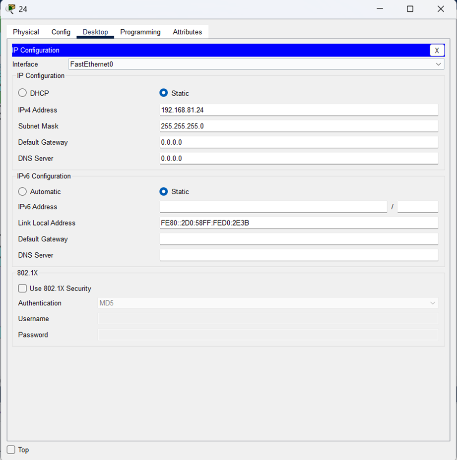
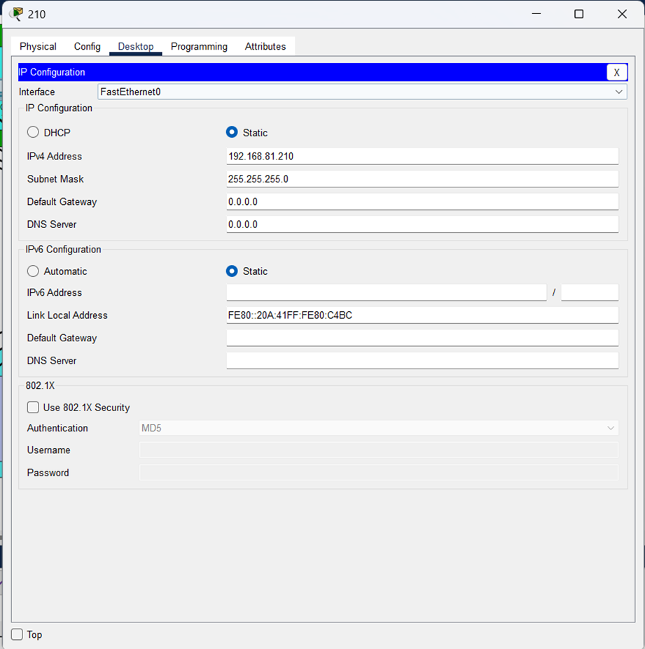
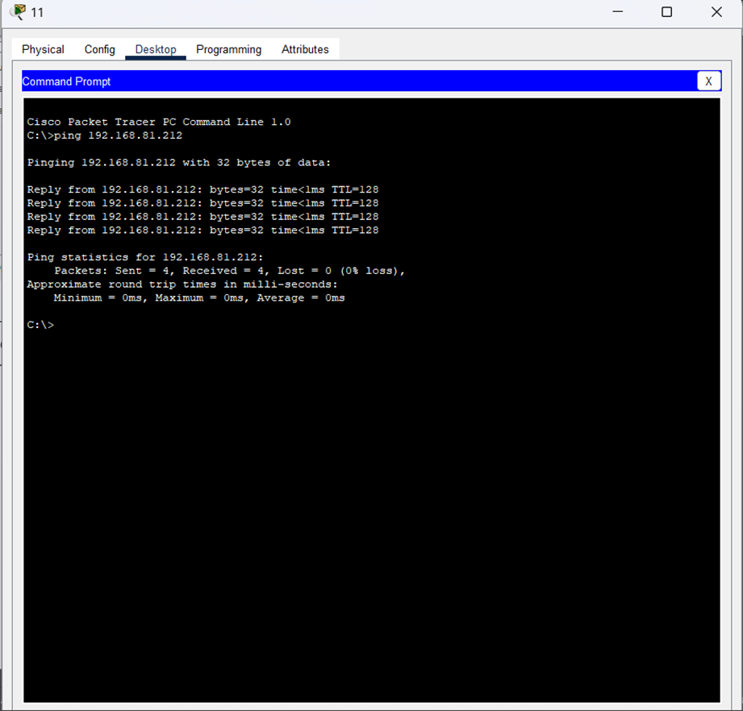
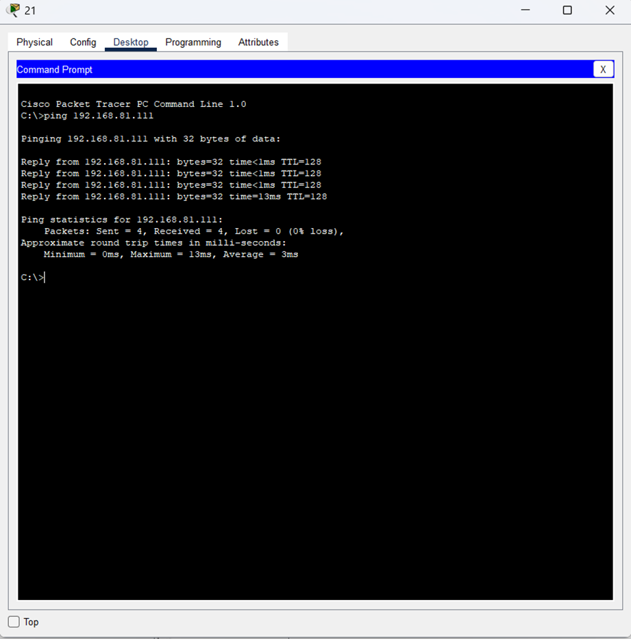
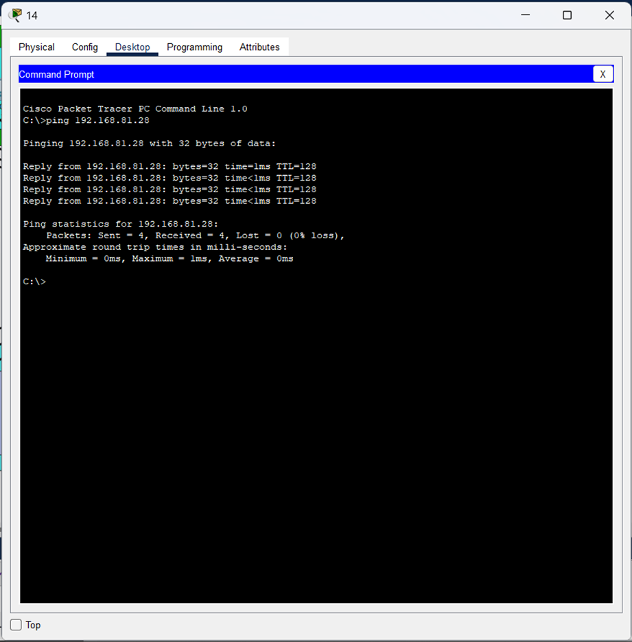
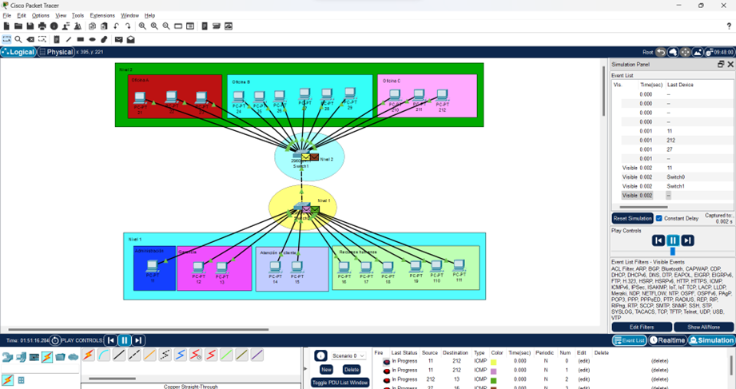

# Manual técnico

## Configuración de las computadoras

### Configuración de la computadora 11 perteneciente a Administración nivel 1

### Configuración de la computadora 12 perteneciente a Gerencia nivel 1

### Configuración de la computadora 14 perteneciente a Atención al cliente nivel 1

### Configuración de la computadora 16 perteneciente a Recursos Humanos nivel 1

### Configuración de la computadora 21 perteneciente a la oficina A nivel 2

### Configuración de la computadora 24 de la oficina B nivel 2

### Configuración de la computadora 210 de la oficina C nivel 2

## Ping entre computadoras de la red

### Ping de la computadora 11 de Administración nivel 1 hacia la computadora 212 de la oficina C nivel 2

### Ping de la computadora 21 de la Oficina A nivel 2 hacia la computadora 111 perteneciente a Recursos Humanos nivel 1

### Ping de la computadora 14 de Atención al cliente  nivel 1 hacia la computadora 28 de la oficina B nivel 2

## Demostración de la captura de un paquete ARP/ICMP (solo 1 en general), incluyendo captura de pantalla. 

una de ganancia :)

