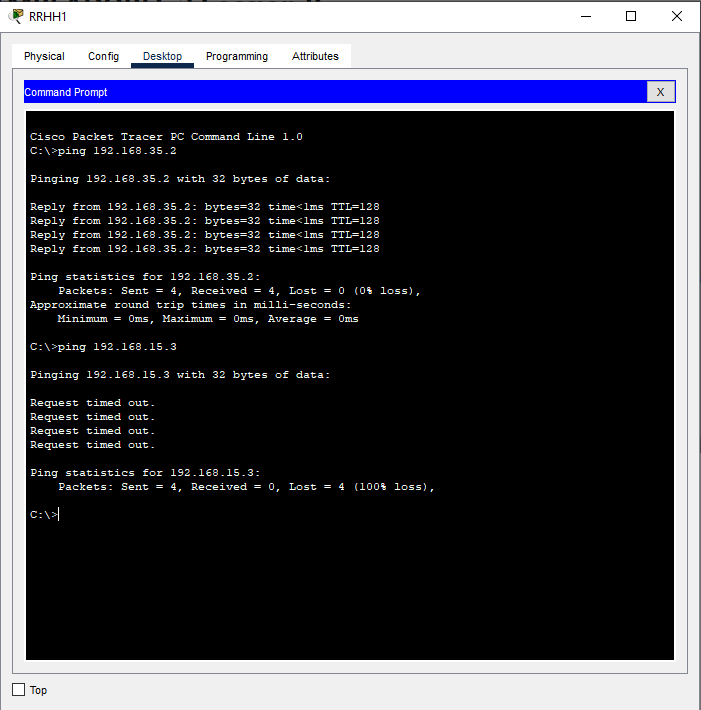

# MANUAL TÉCNICO

### INTEGRANTES GRUPO NO. 13

| Nombre                                | Carné     
|---------------------------------------|-----------
| Douglas Darío Rivera Ojeda            | 201122881
| Steven Josue González Monroy          | 201903974

# PROYECTO 1

Se creó una topología de red reducida que simula las interacciones entre distintos componentes de 4 departamentos, entre dichos departamentos no existe transito de datos, por lo que se implementó una VLAN para cada uno, asi como la configuración de spanning tree protocol para evitar redundancia en el transito de los datos.

# TOPOLOGÍA


La red propuesta consta de tres secciones:

* Centro administrativo.
* Backbone.
* Area de trabajo.

### 1. Centro administrativo

En este se ubica el espacio destinado la administración principal
para cada departamento.


### 2. Backbone

 Son los encargados de dar redundancia y conectividad entre todos los
departamentos y sus servidores. En esta red se deberá localizar tanto el servidor VTP
como la raíz del STP.


### 3. Area de trabajo

En esta área se encuentran todos los dispositivos físicos de cada
departamento.


# DIRECCIONES IP Y VLANS

## VLANS:

| Departamento| VLAN | ID de red |
|------------ |------|-----------|
| Contabilidad| 15   | 192.168.15.0/24    |
| Secretaria  | 25   | 192.168.25.0/24  |
| RRHH        | 35   | 192.168.35.0/24   |
| IT          | 45   | 192.168.45.0/24   |


## Contabilidad


| Equipo| IP   | 
|-------------|------|
| Contabilidad 1 | 192.168.15.1  | 
| Contabilidad 2| 192.168.15.2   | 
| Contabilidad Server        | 192.168.15.3   | 

## Secretaria

| Equipo| IP   | 
|-------------|------|
| Secretaria 1  | 192.168.25.1   | 
| Secretaria 2        | 192.168.25.2   |
| Secretaria 3| 192.168.25.3  | 

## RRHH

| Equipo| IP   | 
|-------------|------|
| RRHH 1        | 192.168.35.1   | 
| RRHH 2        | 192.168.35.2   | 
| RRHH 3   | 192.168.35.3   |
| RRHH Server| 192.168.35.4  | 

## IT

| Equipo| IP   | 
|-------------|------|
| IT 1  | 192.168.45.1   | 
| IT 2        | 192.168.45.2   | 
| IT Server| 192.168.45.3  | 


# COMANDOS UTILIZADOS

### Configuración de Switch en Modo Server

Los siguientes comandos se ejecutaron en el switch SW1.

```bash
    enable
	configure terminal
	vtp mode server
	
	vtp domain P13
	vtp password usac
	vtp version 2
	exit
	wr
```

### Configuración de Switches en Modo Cliente

Los siguientes comandos se ejecutaron en los switches:

* S1, S2, S3, S4, S5, S6, S7, S8
* SW2, SW3, SW4, SW5, SW6, SW7, SW8, SW9, SW10, SW11, SW12

```bash
    enable
	configure terminal
	vtp mode client

	vtp domain P13
	vtp password usac
	exit
	wr
```

### Configuración de Interfaces en Modo Troncal

Los siguientes comandos se ejecutaron en todos los switches, para las interfaces que no se conectan directamente con un host.

```bash
    enable
	configure terminal
	interface range f0/rango
	switchport trunk encapsulation dot1q
	switchport mode trunk
	switchport trunk allowed vlan all
	exit
	exit
	wr
	
	show startup-config
```

### Creación de las VLANS

Estos comandos se ejecutaron en el switch Servidor SW1 y el Transparente SW9

```bash
    enable
	configure terminal
	vlan 15
	name "Contabilidad"
	exit
	vlan 25
	name "Secretaria"
	exit
    vlan 35
	name "RRHH"
	exit
    vlan 45
	name "IT"
	exit
	exit
	wr
	
	show vlan
```

### Configuración de Modo Acceso en Interfaces:

Estos comandos unicamente se ejecutan en switches con interfaces que se conectan a hosts, especificando la vlan a la que tiene permitido conectarse el host.

```bash
    enable
	configure terminal
	interface f0/11
	switchport mode access
	switchport access vlan 15
	no shutdown
	exit
	exit
	wr
```

### Configuración de Switch en modo Root para STP:

Estos comandos se ejecutaron unicamente en el switch SW1.

```bash
    enable
	configure terminal
	spanning-tree vlan 1 root primary
	exit
	wr
	
	show spanning tree
```

### Configurar modo de Spanning tree en los switches


Estos comandos se ejecutaron en todos los swtiches

```bash
    enable
	configure terminal
	spanning-tree mode rapid-pvst
	exit
	wr
	
	show spannig-tree
```


# Ping entre Hosts:

### 1.  Comunicación de Contabilidad en su misma VLAN y hacia otra VLAN:

- 192.168.15.1 -> 192.168.15.3 (Comunicacion en la misma VLAN, se hace el ping correctamente)

- 192.168.15.1 -> 192.168.25.3 (Comunicacion hacia una VLAN diferente, no se hace el ping, por lo que esta bien configurada la VLAN)


### 2.  Comunicación de RRHH en su misma VLAN y hacia otra VLAN:

- 192.168.35.1 -> 192.168.35.2 (Comunicacion en la misma VLAN, se hace el ping correctamente)

- 192.168.35.1 -> 192.168.15.3 (Comunicacion hacia una VLAN diferente, no se hace el ping, por lo que esta bien configurada la VLAN)




