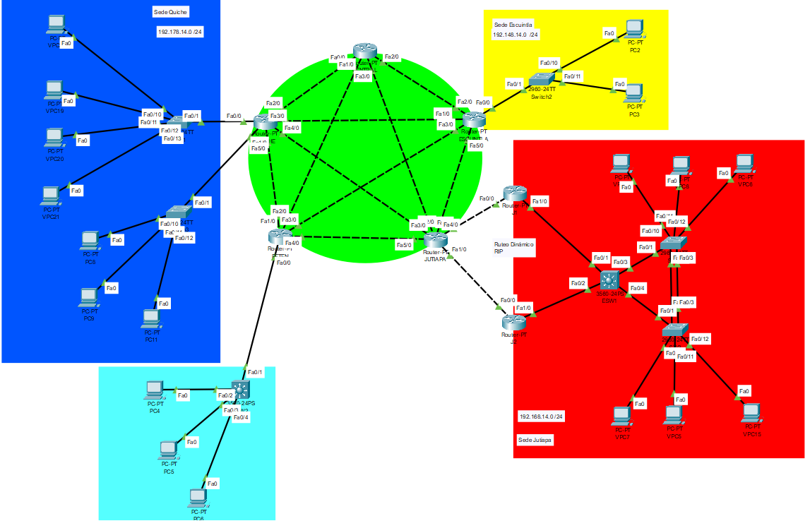
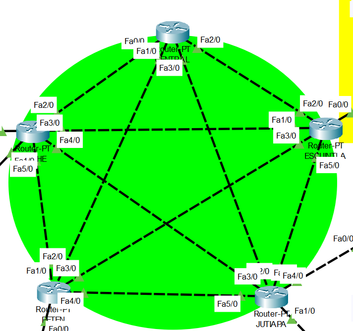
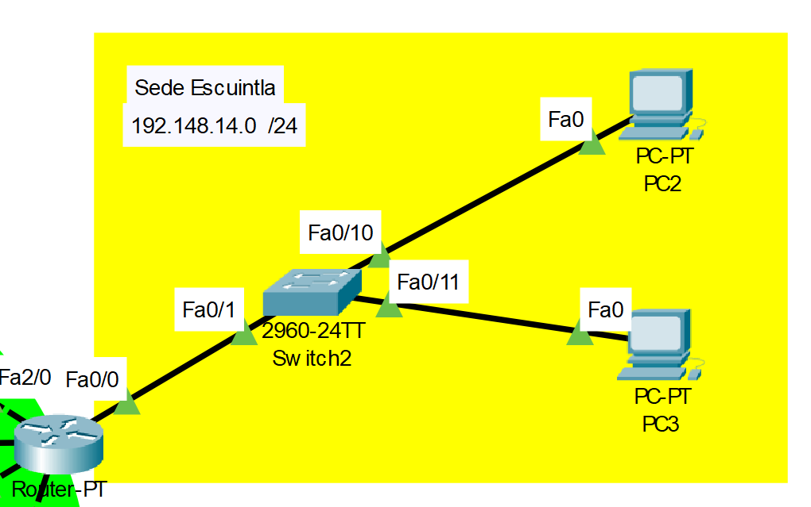
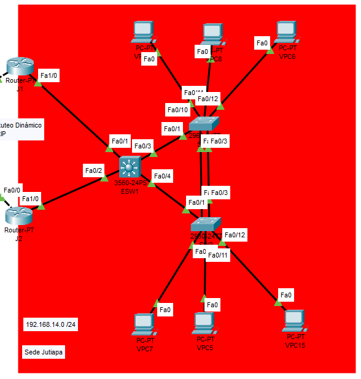
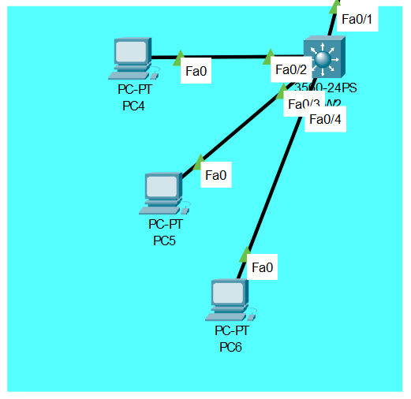
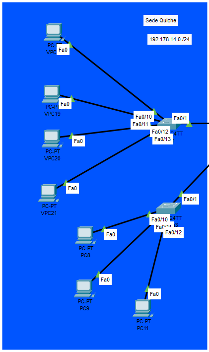

# MANUAL TÉCNICO

### INTEGRANTES GRUPO NO. 13

| Nombre                                | Carné     
|---------------------------------------|-----------
| Douglas Darío Rivera Ojeda            | 201122881
| Steven Josue González Monroy          | 201903974

# PROYECTO 2

Se creó una topología de red  que simula las interacciones entre distintas redes distribuidas en distintos departamentos del pais, cada red maneja departamentos internos de la organizacion entre dichos departamentos no existe transito de datos, por lo que se implementó una VLAN para cada uno, asi como la configuración de spanning tree protocol para evitar redundancia en el transito de los datos.

# TOPOLOGÍA



La red propuesta consta de cico secciones:

* Sede Escuintla.
* Sede Jutiapa.
* Sede Peten.
* Sede Sede Quiche.
* Core Central.

### 1. Core central

En este se ubican los routers centrales que permiten la comunicación entre sedes. Estan conectados entre ellos en una topologia en forma de estrella. Se utilizó FLSM para la segmentacion de las ips.



### 2. Sede Escuintla

 En esta sede se manejan unicamente dos departamentos internos: `RRHH` y `Ventas`. para ello se realizó una VLAN para cada una de estas con un diseño `Router on a Stick`.



### 3. Sede Jutiapa

Esta red cuenta  con cuatro distintos departamentos, `RRHH`,`Ventas`,`Contabilidad` e `Informatica`. Cada uno cuenta con su propia vlan.



### 3. Sede Peten

Esta red cuenta  con tres distintos departamentos, `RRHH`,`Ventas` e `Informatica`. Cada uno cuenta con su propia vlan.



### 3. Sede Quiché

Esta red cuenta  con cuatro distintos departamentos, `RRHH`,`Ventas`,`Contabilidad` e `Informatica`. Cada uno cuenta con su propia vlan.




# DIRECCIONES IP Y VLANS

### 1. Jutiapa 

#### Calculo de VLSM
##### ID de red: 192.168.14.0 /24
| Departamento| VLAN |Equipos Fisicos       | ID de red                      | Host soportados|Primer Host  |Ultimo Host  |
|------------ |------|-------------------   |--------------------            |-------------   |-------------|-------------|
| Ventas      | 35   | 25                   |192.168.14.0 255.255.255.224    |30              |192.168.14.1 |192.168.14.30|
| Informatica | 45   | 12                   |192.168.14.32 255.255.255.240   |14              |192.168.14.33|192.168.14.46|
| RRHH        | 15   | 10                   |192.168.14.48 255.255.255.240   |14              |192.168.14.49|192.168.14.62|
| Contabilidad| 25   | 4                    |192.168.14.64 255.255.255.248   |6               |192.168.14.65|192.168.14.70|

##### Distribución de IPs:

|No.PC| Departamento| Dispositivo |Interfaz| IP           | Mascara     |
|-----|------------ |-------------|--------|--------------|-------------|
|1| Ventas      | VPC7        | eth0   |192.168.14.2  | /27         |
|2| Ventas      | VPC8        | eth0   |192.168.14.3  | /27         |
|3| Ventas      | VPCX        | eth0   |192.168.14.4  | /27         |
|4| Ventas      | VPCX        | eth0   |192.168.14.5  | /27         |
|5| Ventas      | VPCX        | eth0   |192.168.14.6  | /27         |
|6| Ventas      | VPCX        | eth0   |192.168.14.7  | /27         |
|7| Ventas      | VPCX        | eth0   |192.168.14.8  | /27         |
|8| Ventas      | VPCX        | eth0   |192.168.14.9  | /27         |
|9| Ventas      | VPCX        | eth0   |192.168.14.10  | /27         |
|10| Ventas      | VPCX        | eth0   |192.168.14.11  | /27         |
|11| Ventas      | VPCX        | eth0   |192.168.14.12  | /27         |
|12| Ventas      | VPCX        | eth0   |192.168.14.13  | /27         |
|13| Ventas      | VPCX        | eth0   |192.168.14.14  | /27         |
|14| Ventas      | VPCX        | eth0   |192.168.14.15  | /27         |
|15| Ventas      | VPCX        | eth0   |192.168.14.16  | /27         |
|16| Ventas      | VPCX        | eth0   |192.168.14.17  | /27         |
|17| Ventas      | VPCX        | eth0   |192.168.14.18  | /27         |
|18| Ventas      | VPCX        | eth0   |192.168.14.19  | /27         |
|19| Ventas      | VPCX        | eth0   |192.168.14.20  | /27         |
|20| Ventas      | VPCX        | eth0   |192.168.14.21  | /27         |
|21| Ventas      | VPCX        | eth0   |192.168.14.22  | /27         |
|22| Ventas      | VPCX        | eth0   |192.168.14.23  | /27         |
|23| Ventas      | VPCX        | eth0   |192.168.14.24  | /27         |
|24| Ventas      | VPCX        | eth0   |192.168.14.25  | /27         |
|25| Ventas      | VPCX        | eth0   |192.168.14.26  | /27         |
|1| Informatica | VPC5        | eth0   |192.168.14.34 | /28         |
|2| Informatica | VPC6        | eth0   |192.168.14.35 | /28         |
|3| Informatica | VPCX        | eth0   |192.168.14.36 | /28         |
|4| Informatica | VPCX        | eth0   |192.168.14.37 | /28         |
|5| Informatica | VPCX        | eth0   |192.168.14.38 | /28         |
|6| Informatica | VPCX        | eth0   |192.168.14.39 | /28         |
|7| Informatica | VPCX        | eth0   |192.168.14.40 | /28         |
|8| Informatica | VPCX        | eth0   |192.168.14.41 | /28         |
|9| Informatica | VPCX        | eth0   |192.168.14.42 | /28         |
|10| Informatica | VPCX        | eth0   |192.168.14.43 | /28         |
|11| Informatica | VPCX        | eth0   |192.168.14.44 | /28         |
|12| Informatica | VPCX        | eth0   |192.168.14.45 | /28         |
|1| RRHH        | VPC15       | eth0   |192.168.14.50 | /28         |
|2| RRHH        | VPCX       | eth0   |192.168.14.51 | /28         |
|3| RRHH        | VPCX       | eth0   |192.168.14.52 | /28         |
|4| RRHH        | VPCX       | eth0   |192.168.14.53 | /28         |
|5| RRHH        | VPCX       | eth0   |192.168.14.54 | /28         |
|6| RRHH        | VPCX       | eth0   |192.168.14.55 | /28         |
|7| RRHH        | VPCX       | eth0   |192.168.14.56 | /28         |
|8| RRHH        | VPCX       | eth0   |192.168.14.57 | /28         |
|9| RRHH        | VPCX       | eth0   |192.168.14.58 | /28         |
|10| RRHH        | VPCX       | eth0   |192.168.14.59 | /28         |
|1| Contabilidad| VPC14       | eth0   |192.168.14.66 | /29         |
|2| Contabilidad| VPCX       | eth0   |192.168.14.67 | /29         |
|3| Contabilidad| VPCX       | eth0   |192.168.14.68 | /29         |
|4| Contabilidad| VPCX       | eth0   |192.168.14.69 | /29         |

### 2. Escuintla 

#### Calculo de VLSM
##### ID de red: 192.148.14.0 /24

| Departamento| VLAN |Equipos Fisicos       | ID de red                      | Host soportados|Primer Host  |Ultimo Host  |
|------------ |------|-------------------   |--------------------            |-------------   |-------------|-------------|
| Ventas      | 35   | 20                   |192.148.14.0 255.255.255.224    |30              |192.148.14.1 |192.148.14.30|
| RRHH        | 15   | 5                    |192.148.14.32 255.255.255.248   |6              |192.148.14.33|192.148.14.38|

##### Distribución de IPs:

|No.PC| Departamento| Dispositivo |Interfaz| IP           | Mascara     |
|-----|------------ |-------------|--------|--------------|-------------|
|1| Ventas      | PC2       | eth0   |192.148.14.2  | /27         |
|2| Ventas      | PCX        | eth0   |192.148.14.3  | /27         |
|3| Ventas      | PCX        | eth0   |192.148.14.4  | /27         |
|4| Ventas      | PCX        | eth0   |192.148.14.5  | /27         |
|5| Ventas      | PCX        | eth0   |192.148.14.6  | /27         |
|6| Ventas      | PCX        | eth0   |192.148.14.7  | /27         |
|7| Ventas      | PCX        | eth0   |192.148.14.8  | /27         |
|8| Ventas      | PCX        | eth0   |192.148.14.9  | /27         |
|9| Ventas      | PCX        | eth0   |192.148.14.10  | /27         |
|10| Ventas      | PCX        | eth0   |192.148.14.11  | /27         |
|11| Ventas      | PCX        | eth0   |192.148.14.12  | /27         |
|12| Ventas      | PCX        | eth0   |192.148.14.13  | /27         |
|13| Ventas      | PCX        | eth0   |192.148.14.14  | /27         |
|14| Ventas      | PCX        | eth0   |192.148.14.15  | /27         |
|15| Ventas      | PCX        | eth0   |192.148.14.16  | /27         |
|16| Ventas      | PCX        | eth0   |192.148.14.17  | /27         |
|17| Ventas      | PCX        | eth0   |192.148.14.18  | /27         |
|18| Ventas      | PCX        | eth0   |192.148.14.19  | /27         |
|19| Ventas      | PCX        | eth0   |192.148.14.20  | /27         |
|20| Ventas      | PCX        | eth0   |192.148.14.21  | /27         |
|1| RRHH        | PC3       | eth0   |192.148.14.34 | /28         |
|2| RRHH        | PCX       | eth0   |192.148.14.35 | /28         |
|3| RRHH        | PCX       | eth0   |192.148.14.36 | /28         |
|4| RRHH        | PCX       | eth0   |192.148.14.37 | /28         |
|5| RRHH        | PCX       | eth0   |192.148.14.38 | /28         |

### 3. Quiché 

#### Calculo de VLSM
##### ID de red: 192.178.14.0 /24
| Departamento| VLAN |Equipos Fisicos       | ID de red                      | Host soportados|Primer Host  |Ultimo Host  |
|------------ |------|-------------------   |--------------------            |-------------   |-------------|-------------|
| Ventas      | 35   | 36                   |192.178.14.0 255.255.255.192    |62              |192.178.14.1 |192.178.14.62|
| Informatica | 45   | 21                   |192.178.14.64 255.255.255.224   |30              |192.178.14.65|192.178.14.94|
| RRHH        | 15   | 12                   |192.178.14.96 255.255.255.240   |14              |192.178.14.97|192.178.14.110|
| Contabilidad| 25   | 10                   |192.178.14.112 255.255.255.240  |14              |192.178.14.113|192.178.14.126|

##### Distribución de IPs:

|No.PC| Departamento| Dispositivo |Interfaz| IP           | Mascara     |
|-----|------------ |-------------|--------|--------------|-------------|
|1| Ventas      | VPC22        | eth0   |192.178.14.2  | /26         |
|2| Ventas      | VPC21        | eth0   |192.178.14.3  | /26         |
|3| Ventas      | VPCX        | eth0   |192.178.14.4  | /26         |
|4| Ventas      | VPCX        | eth0   |192.178.14.5  | /26         |
|5| Ventas      | VPCX        | eth0   |192.178.14.6  | /26         |
|6| Ventas      | VPCX        | eth0   |192.178.14.7  | /26         |
|7| Ventas      | VPCX        | eth0   |192.178.14.8  | /26         |
|8| Ventas      | VPCX        | eth0   |192.178.14.9  | /26         |
|9| Ventas      | VPCX        | eth0   |192.178.14.10  | /26         |
|10| Ventas      | VPCX        | eth0   |192.178.14.11  | /26         |
|11| Ventas      | VPCX        | eth0   |192.178.14.12  | /26         |
|12| Ventas      | VPCX        | eth0   |192.178.14.13  | /26         |
|13| Ventas      | VPCX        | eth0   |192.178.14.14  | /26         |
|14| Ventas      | VPCX        | eth0   |192.178.14.15  | /26         |
|15| Ventas      | VPCX        | eth0   |192.178.14.16  | /26         |
|16| Ventas      | VPCX        | eth0   |192.178.14.17  | /26         |
|17| Ventas      | VPCX        | eth0   |192.178.14.18  | /26         |
|18| Ventas      | VPCX        | eth0   |192.178.14.19  | /26         |
|19| Ventas      | VPCX        | eth0   |192.178.14.20  | /26         |
|20| Ventas      | VPCX        | eth0   |192.178.14.21  | /26         |
|21| Ventas      | VPCX        | eth0   |192.178.14.22  | /26         |
|22| Ventas      | VPCX        | eth0   |192.178.14.23  | /26         |
|23| Ventas      | VPCX        | eth0   |192.178.14.24  | /26         |
|24| Ventas      | VPCX        | eth0   |192.178.14.25  | /26         |
|25| Ventas      | VPCX        | eth0   |192.178.14.26  | /26         |
|26| Ventas      | VPCX        | eth0   |192.178.14.27  | /26         |
|27| Ventas      | VPCX        | eth0   |192.178.14.28  | /26         |
|28| Ventas      | VPCX        | eth0   |192.178.14.29  | /26         |
|29| Ventas      | VPCX        | eth0   |192.178.14.30  | /26         |
|30| Ventas      | VPCX        | eth0   |192.178.14.31  | /26         |
|31| Ventas      | VPCX        | eth0   |192.178.14.32  | /26         |
|32| Ventas      | VPCX        | eth0   |192.178.14.33  | /26         |
|33| Ventas      | VPCX        | eth0   |192.178.14.34  | /26         |
|34| Ventas      | VPCX        | eth0   |192.178.14.35  | /26         |
|35| Ventas      | VPCX        | eth0   |192.178.14.36  | /26         |
|36| Ventas      | VPCX        | eth0   |192.178.14.37  | /26         |
|1| Informatica | VPC19        | eth0   |192.178.14.67 | /27         |
|2| Informatica | VPC8        | eth0   |192.178.14.68 | /27         |
|3| Informatica | VPCX        | eth0   |192.178.14.69 | /27         |
|4| Informatica | VPCX        | eth0   |192.178.14.70 | /27         |
|5| Informatica | VPCX        | eth0   |192.178.14.71 | /27         |
|6| Informatica | VPCX        | eth0   |192.178.14.72 | /27         |
|7| Informatica | VPCX        | eth0   |192.178.14.73 | /27         |
|8| Informatica | VPCX        | eth0   |192.178.14.74 | /27         |
|9| Informatica | VPCX        | eth0   |192.178.14.75 | /27         |
|10| Informatica | VPCX        | eth0   |192.178.14.76 | /27         |
|11| Informatica | VPCX        | eth0   |192.178.14.77 | /27         |
|12| Informatica | VPCX        | eth0   |192.178.14.78 | /27         |
|13| Informatica | VPCX        | eth0   |192.178.14.79 | /27         |
|14| Informatica | VPCX        | eth0   |192.178.14.80 | /27         |
|15| Informatica | VPCX        | eth0   |192.178.14.81 | /27         |
|16| Informatica | VPCX        | eth0   |192.178.14.82 | /27         |
|17| Informatica | VPCX        | eth0   |192.178.14.83 | /27         |
|18| Informatica | VPCX        | eth0   |192.178.14.84 | /27         |
|19| Informatica | VPCX        | eth0   |192.178.14.85 | /27         |
|20| Informatica | VPCX        | eth0   |192.178.14.86 | /27         |
|21| Informatica | VPCX        | eth0   |192.178.14.87 | /27         |
|1| RRHH        | VPC20       | eth0   |192.178.14.99 | /28         |
|2| RRHH        | VPC9       | eth0   |192.178.14.100 | /28         |
|3| RRHH        | VPCX       | eth0   |192.178.14.101 | /28         |
|4| RRHH        | VPCX       | eth0   |192.178.14.102 | /28         |
|5| RRHH        | VPCX       | eth0   |192.178.14.103 | /28         |
|6| RRHH        | VPCX       | eth0   |192.178.14.104 | /28         |
|7| RRHH        | VPCX       | eth0   |192.178.14.105 | /28         |
|8| RRHH        | VPCX       | eth0   |192.178.14.106 | /28         |
|9| RRHH        | VPCX       | eth0   |192.178.14.107 | /28         |
|10| RRHH        | VPCX       | eth0   |192.178.14.108 | /28         |
|11| RRHH        | VPCX       | eth0   |192.178.14.109 | /28         |
|12| RRHH        | VPCX       | eth0   |192.178.14.110 | /28         |
|1| Contabilidad| VPC11       | eth0   |192.178.14.115 | /28         |
|2| Contabilidad| VPCX       | eth0   |192.178.14.116 | /28         |
|3| Contabilidad| VPCX       | eth0   |192.178.14.117 | /28         |
|4| Contabilidad| VPCX       | eth0   |192.178.14.118 | /28         |
|5| Contabilidad| VPCX       | eth0   |192.178.14.119 | /28         |
|6| Contabilidad| VPCX       | eth0   |192.178.14.120 | /28         |
|7| Contabilidad| VPCX       | eth0   |192.178.14.121 | /28         |
|8| Contabilidad| VPCX       | eth0   |192.178.14.122 | /28         |
|9| Contabilidad| VPCX       | eth0   |192.178.14.123 | /28         |
|10| Contabilidad| VPCX       | eth0   |192.178.14.124 | /28        |


### 4. Petén

#### Calculo de VLSM
##### ID de red: 192.158.14.0 /24
| Departamento| VLAN |Equipos Fisicos       | ID de red                      | Host soportados|Primer Host  |Ultimo Host  |
|------------ |------|-------------------   |--------------------            |-------------   |-------------|-------------|
| Ventas      | 35   | 30                   |192.158.14.0 255.255.255.224    |30              |192.158.14.1 |192.158.14.30|
| Informatica | 45   | 15                   |192.158.14.64 255.255.255.224   |30              |192.158.13.33|192.158.14.62|
| RRHH        | 15   | 10                   |192.158.14.96 255.255.255.240   |14              |192.158.14.65|192.158.14.78|

##### Distribución de IPs:

|No.PC| Departamento| Dispositivo |Interfaz| IP           | Mascara     |
|-----|------------ |-------------|--------|--------------|-------------|
|1| Ventas      | PC4        | eth0   |192.158.14.2  | /27        |
|2| Ventas      | PCX        | eth0   |192.158.14.3  | /27        |
|3| Ventas      | PCX        | eth0   |192.158.14.4  | /27        |
|4| Ventas      | PCX        | eth0   |192.158.14.5  | /27        |
|5| Ventas      | PCX        | eth0   |192.158.14.6  | /27        |
|6| Ventas      | PCX        | eth0   |192.158.14.7  | /27        |
|7| Ventas      | PCX        | eth0   |192.158.14.8  | /27        |
|8| Ventas      | PCX        | eth0   |192.158.14.9  | /27        |
|9| Ventas      | PCX        | eth0   |192.158.14.10  | /27        |
|10| Ventas      | PCX        | eth0   |192.158.14.11  | /27        |
|11| Ventas      | PCX        | eth0   |192.158.14.12  | /27        |
|12| Ventas      | PCX        | eth0   |192.158.14.13  | /27        |
|13| Ventas      | PCX        | eth0   |192.158.14.14  | /27        |
|14| Ventas      | PCX        | eth0   |192.158.14.15  | /27        |
|15| Ventas      | PCX        | eth0   |192.158.14.16  | /27        |
|16| Ventas      | PCX        | eth0   |192.158.14.17  | /27        |
|17| Ventas      | PCX        | eth0   |192.158.14.18  | /27        |
|18| Ventas      | PCX        | eth0   |192.158.14.19  | /27        |
|19| Ventas      | PCX        | eth0   |192.158.14.20  | /27        |
|20| Ventas      | PCX        | eth0   |192.158.14.21  | /27        |
|21| Ventas      | PCX        | eth0   |192.158.14.22  | /27        |
|22| Ventas      | PCX        | eth0   |192.158.14.23  | /27        |
|23| Ventas      | PCX        | eth0   |192.158.14.24  | /27        |
|24| Ventas      | PCX        | eth0   |192.158.14.25  | /27        |
|25| Ventas      | PCX        | eth0   |192.158.14.26  | /27        |
|26| Ventas      | PCX        | eth0   |192.158.14.27  | /27        |
|27| Ventas      | PCX        | eth0   |192.158.14.28  | /27        |
|28| Ventas      | PCX        | eth0   |192.158.14.29  | /27        |
|29| Ventas      | PCX        | eth0   |192.158.14.30  | /27        |
|30| Ventas      | PCX        | eth0   |192.158.14.31  | /27        |
|1| Informatica | PC5        | eth0   |192.158.14.34 | /27         |
|2| Informatica | PCX       | eth0   |192.158.14.35 | /27         |
|3| Informatica | PCX        | eth0   |192.158.14.36 | /27         |
|4| Informatica | PCX        | eth0   |192.158.14.37 | /27         |
|5| Informatica | PCX        | eth0   |192.158.14.38 | /27         |
|6| Informatica | PCX        | eth0   |192.158.14.39 | /27         |
|7| Informatica | PCX        | eth0   |192.158.14.40 | /27         |
|8| Informatica | PCX        | eth0   |192.158.14.41 | /27         |
|9| Informatica | PCX        | eth0   |192.158.14.42 | /27         |
|10| Informatica | PCX        | eth0   |192.158.14.43 | /27         |
|11| Informatica | PCX        | eth0   |192.158.14.44 | /27         |
|12| Informatica | PCX        | eth0   |192.158.14.45 | /27         |
|13| Informatica | PCX        | eth0   |192.158.14.46 | /27         |
|14| Informatica | PCX        | eth0   |192.158.14.47 | /27         |
|15| Informatica | PCX        | eth0   |192.158.14.48 | /27         |
|1| RRHH        | PC6       | eth0   |192.158.14.66 | /28         |
|2| RRHH        | PCX       | eth0   |192.158.14.67 | /28         |
|3| RRHH        | PCX       | eth0   |192.158.14.68 | /28         |
|4| RRHH        | PCX       | eth0   |192.158.14.69 | /28         |
|5| RRHH        | PCX       | eth0   |192.158.14.70 | /28         |
|6| RRHH        | PCX       | eth0   |192.158.14.71 | /28         |
|7| RRHH        | PCX       | eth0   |192.158.14.72 | /28         |
|8| RRHH        | PCX       | eth0   |192.158.14.73 | /28         |
|9| RRHH        | PCX       | eth0   |192.158.14.74 | /28         |
|10| RRHH        | PCX       | eth0   |192.158.14.75 | /28         |

### 5. Core

#### Calculo de FLSM
##### ID de red: 10.0.0.0 /24

Se necesitan 10 subredes:

| Subred | Host soportados | ID de red            | Primer Host  |Ultimo Host  |
|------------ |------|--------------------        |------------- |-------------|
| Subred 1    | 14   | 10.0.0.0 255.255.255.240   |10.0.0.1      |10.0.0.14|
| Subred 2    | 14   | 10.0.0.16 255.255.255.240  |10.0.0.17     |10.0.0.30|
| Subred 3    | 14   | 10.0.0.32 255.255.255.240  |10.0.0.33     |10.0.0.46|
| Subred 4    | 14   | 10.0.0.48 255.255.255.240  |10.0.0.49     |10.0.0.62|
| Subred 5    | 14   | 10.0.0.64 255.255.255.240  |10.0.0.65     |10.0.0.78|
| Subred 6    | 14   | 10.0.0.80 255.255.255.240  |10.0.0.81     |10.0.0.94|
| Subred 7    | 14   | 10.0.0.96 255.255.255.240  |10.0.0.97     |10.0.0.110|
| Subred 8    | 14   | 10.0.0.112 255.255.255.240  |10.0.0.113     |10.0.0.126|
| Subred 9    | 14   | 10.0.0.128 255.255.255.240  |10.0.0.129    |10.0.0.142|
| Subred 10   | 14   | 10.0.0.144 255.255.255.240  |10.0.0.145    |10.0.0.158|

##### Distribución de IPs:

| Dispositivo |Interfaz | IP          | Mascara    |
|-------------|-------- |-------------|------------|
| CENTRAL     |Fa0/0    |10.0.0.1     | /28        |
|             |Fa1/0    |10.0.0.17    | /28        |
|             |Fa2/0    |10.0.0.33    | /28        |
|             |Fa3/0    |10.0.0.49    | /28        |
|ESCUINTLA    |Fa1/0    |10.0.0.65    | /28        |
|             |Fa2/0    |10.0.0.34    | /28        |
|             |Fa3/0    |10.0.0.81    | /28        |
|             |Fa5/0    |10.0.0.97    | /28        |
|JUTIAPA      |Fa2/0    |10.0.0.113   | /28        |
|             |Fa3/0    |10.0.0.50    | /28        |
|             |Fa4/0    |10.0.0.98    | /28        |
|             |Fa5/0    |10.0.0.129   | /28        |
|PETEN        |Fa1/0    |10.0.0.145   | /28        |
|             |Fa2/0    |10.0.0.18    | /28        |
|             |Fa3/0    |10.0.0.82    | /28        |
|             |Fa4/0    |10.0.0.130   | /28        |
|QUICHE       |Fa2/0    |10.0.0.2     | /28        |
|             |Fa3/0    |10.0.0.66    | /28        |
|             |Fa4/0    |10.0.0.114   | /28        |
|             |Fa5/0    |10.0.0.146   | /28        |

# COMANDOS UTILIZADOS

## Configuraciones de Jutiapa
### Configuración de Switch en Modo Server

Los siguientes comandos se ejecutaron en el switch ESW1.

```bash
    enable
	configure terminal
	vtp mode server
	
	vtp domain P13
	vtp password usac
	vtp version 2
	exit
	wr
```

### Configuración de Switches en Modo Cliente

Los siguientes comandos se ejecutaron en los switches:

* SW2, SW3

```bash
    enable
	configure terminal
	vtp mode client

	vtp domain P13
	vtp password usac
	exit
	wr
```

### Configuración de Interfaces en Modo Troncal

Los siguientes comandos se ejecutaron en todos los switches, para las interfaces que no se conectan directamente con un host.

```bash
    enable
	configure terminal
	interface range f0/rango
	switchport trunk encapsulation dot1q
	switchport mode trunk
	switchport trunk allowed vlan all
	exit
	exit
	wr
	
	show startup-config
```

### Creación de las VLANS

Estos comandos se ejecutaron en el switch Servidor SW1 y el Transparente SW9

```bash
    enable
	configure terminal
	vlan 25
	name Contabilidad
	exit
	vlan 15
	name RRHH
	exit
    vlan 35
	name Ventas
	exit
    vlan 45
	name Informatica
	exit
	exit
	wr
	
	show vlan
```

### Configuración de Modo Acceso en Interfaces:

Estos comandos unicamente se ejecutan en switches con interfaces que se conectan a hosts, especificando la vlan a la que tiene permitido conectarse el host.

```bash
    enable
	configure terminal
	interface f0/10
	switchport mode access
	switchport access vlan 35
	no shutdown
	exit
	exit
	wr
```

### Creación de SVIS en switch de capa 3

```bash
enable
configure terminal
interface vlan 35
ip address 192.168.14.1 255.255.255.224
no shutdown
exit

interface vlan 45
ip address 192.168.14.33 255.255.255.240
no shutdown
exit

interface vlan 15
ip address 192.168.14.49 255.255.255.240
no shutdown
exit


interface vlan 25
ip address 192.168.14.65 255.255.255.248
no shutdown
exit
```

### Configuracion de interfaces LACP para etherchannel

```bash
enable
configure terminal
interface range fa0/2-3
channel-group 1 mode active
exit
interface port-channel 1
switchport mode trunk
end
wr

show running-config
show etherchannel
```

### Configuración de Switch en modo Root para Spanning tree:

Estos comandos se ejecutaron unicamente en el switch SW1.

```bash
    enable
	configure terminal
	spanning-tree vlan 1 root primary
	exit
	wr
	
	show spanning tree
```

### Configurar modo de rstp en los switches


Estos comandos se ejecutaron en todos los swtiches

```bash
    enable
	configure terminal
	spanning-tree mode rapid-pvst
	exit
	wr
	
	show spannig-tree
```

### Configuracion de HSRP entre Routers J1 y J2

```bash
------------------------J1 ----------------------
enable
conf t
no ip domain-lookup
hostname J1

interface fa1/0
ip add 192.167.14.2 255.255.255.0
standby 14 ip 192.167.14.1
standby 14 priority 150
standby 14 preempt
no shutdown
do w

interface f0/0
ip add 11.0.0.1 255.255.255.0
no shutdown
do w

-----------------------J2------------------------

enable
conf t
no ip domain-lookup
hostname J2

interface fa1/0
ip add 192.167.14.3 255.255.255.0
standby 14 ip 192.167.14.1
no shutdown
do w

interface f0/0
ip add 12.0.0.1 255.255.255.0
no shutdown
do w


```


## Configuraciones en Escuintla

### Configuracion de modo troncal en interfaces

```bash
enable
configure terminal
interface f0/1
switchport mode trunk
exit
exit
wr
```

### Creación de VLANS

```bash
enable
configure terminal
vlan 15
name "RRH"
exit
vlan 35
name "Ventas"
exit
exit
wr
	
show vlan
```

### Configuracion de interfaces en modo acceso

```bash
enable
configure terminal
interface f0/10
switchport mode access
switchport access vlan 35
no shutdown
exit
exit
wr

enable
configure terminal
interface f0/11
switchport mode access
switchport access vlan 15
no shutdown
exit
exit
wr
```

### Configuracion del STP

```bash
enable
configure terminal
spanning-tree mode rapid-pvst
exit
wr
```

### Configuracion de subinterfaces para router on a stick
```bash
enable
configure terminal
interface fa0/0
no shutdown
interface fa0/0.15
encapsulation dot1q 15
ip address 192.148.14.33 255.255.255.248
no shutdown


enable
configure terminal
interface fa0/0
no shutdown
interface fa0/0.35
encapsulation dot1q 35
ip address 192.148.14.1 255.255.255.224
no shutdown
```

## Configuraciones del CORE

### Habilitación de interfaces en el router Central

```bash
enable
conf t
no ip domain-lookup
hostname CENTRAL

interface f0/0
ip add 10.0.0.1 255.255.255.240
no shutdown
exit
do w

interface f1/0
ip add 10.0.0.17 255.255.255.240
no shutdown
exit
do w

interface f2/0
ip add 10.0.0.33 255.255.255.240
no shutdown
exit
do w


interface f3/0
ip add 10.0.0.49 255.255.255.240
no shutdown
exit
do w
```

### Habilitacion de interfaces en el router JUTIAPA

```bash
enable
conf t
no ip domain-lookup
hostname JUTIAPA

interface f0/0
ip add 11.0.0.2 255.255.255.0
no shutdown
exit
do w


interface f1/0
ip add 12.0.0.2 255.255.255.0
no shutdown
exit
do w

interface f2/0
ip add 10.0.0.113 255.255.255.240
no shutdown
exit
do w

interface f3/0
ip add 10.0.0.50 255.255.255.240
no shutdown
exit
do w

interface f4/0
ip add 10.0.0.98 255.255.255.240
no shutdown
exit
do w


interface f5/0
ip add 10.0.0.129 255.255.255.240
no shutdown
exit
do w
```

### Habilitacion de interfaces en ESCUINTLA

```bash
enable
conf t
no ip domain-lookup
hostname ESCUINTLA

interface f0/0
no shutdown
exit
do w

interface f1/0
ip add 10.0.0.65 255.255.255.240
no shutdown
exit
do w

interface f2/0
ip add 10.0.0.34 255.255.255.240
no shutdown
exit
do w

interface f3/0
ip add 10.0.0.81 255.255.255.240
no shutdown
exit
do w


interface f5/0
ip add 10.0.0.97 255.255.255.240
no shutdown
exit
do w
```

### Habilitación de interfaces en PETEN

```bash
enable
conf t
no ip domain-lookup
hostname PETEN

interface f1/0
ip add 10.0.0.145 255.255.255.240
no shutdown
exit
do w

interface f2/0
ip add 10.0.0.18 255.255.255.240
no shutdown
exit
do w

interface f3/0
ip add 10.0.0.82 255.255.255.240
no shutdown
exit
do w


interface f4/0
ip add 10.0.0.130 255.255.255.240
no shutdown
exit
do w
```

### Habilitación de interfaces en QUICHE

```bash
enable
conf t
no ip domain-lookup
hostname QUICHE

interface f2/0
ip add 10.0.0.2 255.255.255.240
no shutdown
exit
do w

interface f3/0
ip add 10.0.0.66 255.255.255.240
no shutdown
exit
do w

interface f4/0
ip add 10.0.0.114 255.255.255.240
no shutdown
exit
do w


interface f5/0
ip add 10.0.0.146 255.255.255.240
no shutdown
exit
do w
```

### Creación de subinterfaces al router QUICHE

```bash
enable
configure terminal
interface fa0/0
no shutdown
interface fa0/0.15
encapsulation dot1q 15
ip address 192.178.14.97 255.255.255.240
no shutdown


enable
configure terminal
interface fa0/0
no shutdown
interface fa0/0.35
encapsulation dot1q 35
ip address 192.178.14.1 255.255.255.192
no shutdown


enable
configure terminal
interface fa0/0
no shutdown
interface fa0/0.45
encapsulation dot1q 45
ip address 192.178.14.65 255.255.255.224
no shutdown


enable
configure terminal
interface fa0/0
no shutdown
interface fa0/0.25
encapsulation dot1q 25
ip address 192.178.14.113 255.255.255.240
no shutdown


enable
configure terminal
interface fa1/0
no shutdown
interface fa1/0.15
encapsulation dot1q 15
ip address 192.178.14.98 255.255.255.240
no shutdown
do w
exit 
exit
exit

enable
configure terminal
interface fa1/0
no shutdown
interface fa1/0.35
encapsulation dot1q 35
ip address 192.178.14.2 255.255.255.192
no shutdown
do w
exit 
exit
exit

enable
configure terminal
interface fa1/0
no shutdown
interface fa1/0.45
encapsulation dot1q 45
ip address 192.178.14.66 255.255.255.224
no shutdown
do w
exit 
exit
exit

enable
configure terminal
interface fa1/0
no shutdown
interface fa1/0.25
encapsulation dot1q 25
ip address 192.178.14.114 255.255.255.240
no shutdown
do w
exit 
exit
exit

```


## Configuraciones en QUICHE

### Configurar interfaces en modo Troncal

```bash
enable
configure terminal
interface f0/1
switchport mode trunk
exit
exit
wr
```

### Creación de VLANS

```bash
enable
configure terminal
vlan 15
name RRHH
exit
vlan 35
name Ventas
exit
vlan 25
name Contabilidad
exit
vlan 45
name Informatica
exit
exit
wr
	
show vlan
```

### Configuracion de interfaces en modo acceso

```bash
enable
configure terminal
interface f0/10
switchport mode access
switchport access vlan 35
no shutdown
exit
exit
wr

enable
configure terminal
interface f0/11
switchport mode access
switchport access vlan 45
no shutdown
exit
exit
wr

enable
configure terminal
interface f0/12
switchport mode access
switchport access vlan 15
no shutdown
exit
exit
wr

enable
configure terminal
interface f0/13
switchport mode access
switchport access vlan 35
no shutdown
exit
exit
wr

```


### Configuracion de spanning tree

```bash
enable
configure terminal
spanning-tree mode rapid-pvst
exit
wr
```

## Configuraciones en Peten

### Creación de VLANS

```bash
    enable
	configure terminal
	vlan 15
	name RRHH
	exit
    vlan 35
	name Ventas
	exit
    vlan 45
	name Informatica
	exit
	exit
	wr
	
	show vlan
```

### Configuración de modo troncal al switch de capa 3

```bash
enable
	configure terminal
	interface fa0/1
	switchport trunk encapsulation dot1q
	switchport mode trunk
	switchport trunk allowed vlan all
	exit 
	exit 
	wr
```


### Creación de SVIS al switch de capa 3

```bash
enable
configure terminal
interface vlan 35
ip address 192.158.14.1 255.255.255.224
no shutdown
exit

interface vlan 45
ip address 192.158.14.33 255.255.255.224
no shutdown
exit

interface vlan 15
ip address 192.158.14.65 255.255.255.240
no shutdown
exit
```

### Configuración de interfaces en modo acceso

```bash
enable
configure terminal
interface f0/2
switchport mode access
switchport access vlan 35
no shutdown
exit
exit
wr

enable
configure terminal
interface f0/3
switchport mode access
switchport access vlan 45
no shutdown
exit
exit
wr


enable
configure terminal
interface f0/4
switchport mode access
switchport access vlan 15
no shutdown
exit
exit
wr
```

